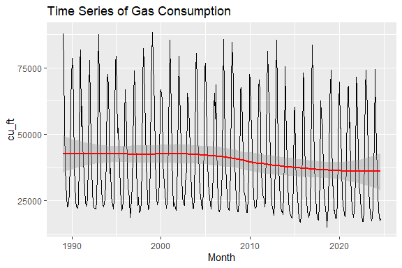
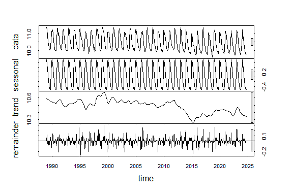
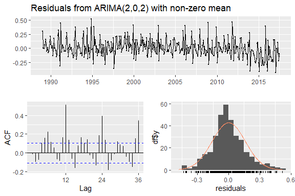
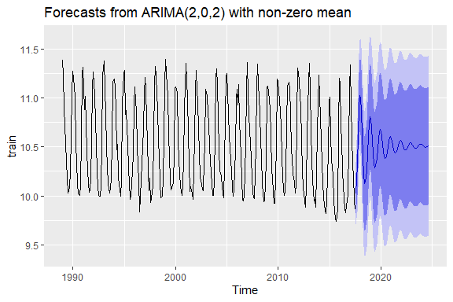
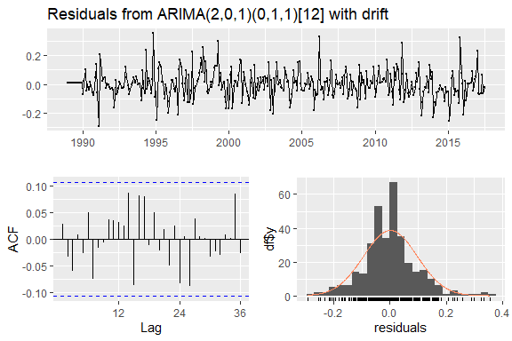
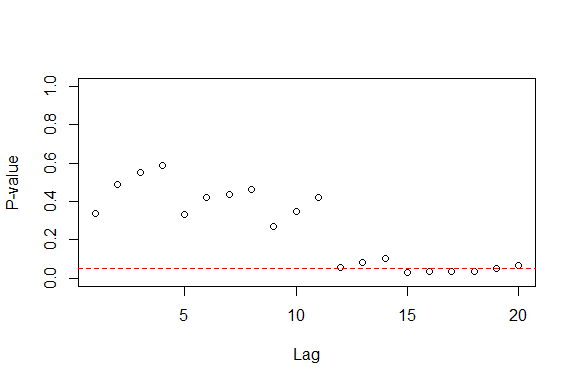
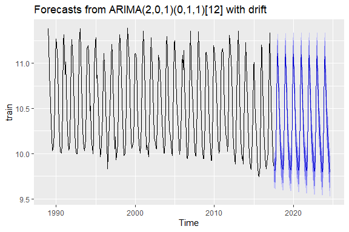
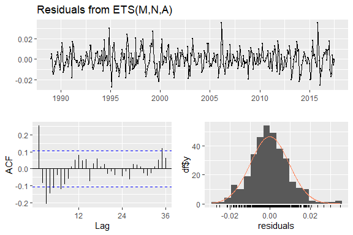
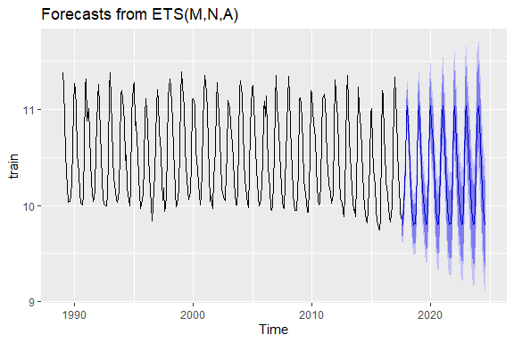
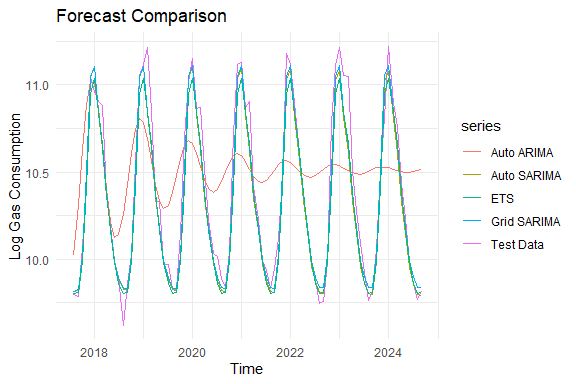

Gas Consumption in California
================
Elena
2025-03-27

- [About this project](#about-this-project)
- [Dataset description](#dataset-description)
- [Data Cleaning and Imputation](#data-cleaning-and-imputation)
- [EDA](#eda)
- [Distribution and Stationarity
  Tests](#distribution-and-stationarity-tests)
- [Log-Transformation and
  Decomposition](#log-transformation-and-decomposition)
  - [ACF/PACF plots](#acfpacf-plots)
  - [Splitting into Train and Test](#splitting-into-train-and-test)
- [Modeling](#modeling)
  - [Auto-SARIMA](#auto-sarima)
  - [SARIMA with Grid-Search](#sarima-with-grid-search)
  - [ETS Model](#ets-model)
- [Conclusion:](#conclusion)

## About this project

This R Markdown notebook explores and forecasts monthly residential
natural gas consumption in California using ARIMA and SARIMA models.

``` r
# Restart R before running this (no packages loaded yet)

# List of packages
pkgs <- c("rmarkdown", "knitr", "devtools", "ggplot2", "patchwork",
          "forecast", "tseries", "urca", "DescTools", "dplyr",
          "FinTS", "fUnitRoots", "TSA")

# Install any that aren't already installed
install_if_missing <- function(p) {
  if (!requireNamespace(p, quietly = TRUE)) {
    install.packages(p, dependencies = TRUE)
  }
}
invisible(sapply(pkgs, install_if_missing))

# Load libraries
lapply(pkgs, library, character.only = TRUE)
```

    ## [[1]]
    ## [1] "rmarkdown" "stats"     "graphics"  "grDevices" "utils"     "datasets" 
    ## [7] "methods"   "base"     
    ## 
    ## [[2]]
    ## [1] "knitr"     "rmarkdown" "stats"     "graphics"  "grDevices" "utils"    
    ## [7] "datasets"  "methods"   "base"     
    ## 
    ## [[3]]
    ##  [1] "devtools"  "usethis"   "knitr"     "rmarkdown" "stats"     "graphics" 
    ##  [7] "grDevices" "utils"     "datasets"  "methods"   "base"     
    ## 
    ## [[4]]
    ##  [1] "ggplot2"   "devtools"  "usethis"   "knitr"     "rmarkdown" "stats"    
    ##  [7] "graphics"  "grDevices" "utils"     "datasets"  "methods"   "base"     
    ## 
    ## [[5]]
    ##  [1] "patchwork" "ggplot2"   "devtools"  "usethis"   "knitr"     "rmarkdown"
    ##  [7] "stats"     "graphics"  "grDevices" "utils"     "datasets"  "methods"  
    ## [13] "base"     
    ## 
    ## [[6]]
    ##  [1] "forecast"  "patchwork" "ggplot2"   "devtools"  "usethis"   "knitr"    
    ##  [7] "rmarkdown" "stats"     "graphics"  "grDevices" "utils"     "datasets" 
    ## [13] "methods"   "base"     
    ## 
    ## [[7]]
    ##  [1] "tseries"   "forecast"  "patchwork" "ggplot2"   "devtools"  "usethis"  
    ##  [7] "knitr"     "rmarkdown" "stats"     "graphics"  "grDevices" "utils"    
    ## [13] "datasets"  "methods"   "base"     
    ## 
    ## [[8]]
    ##  [1] "urca"      "tseries"   "forecast"  "patchwork" "ggplot2"   "devtools" 
    ##  [7] "usethis"   "knitr"     "rmarkdown" "stats"     "graphics"  "grDevices"
    ## [13] "utils"     "datasets"  "methods"   "base"     
    ## 
    ## [[9]]
    ##  [1] "DescTools" "urca"      "tseries"   "forecast"  "patchwork" "ggplot2"  
    ##  [7] "devtools"  "usethis"   "knitr"     "rmarkdown" "stats"     "graphics" 
    ## [13] "grDevices" "utils"     "datasets"  "methods"   "base"     
    ## 
    ## [[10]]
    ##  [1] "dplyr"     "DescTools" "urca"      "tseries"   "forecast"  "patchwork"
    ##  [7] "ggplot2"   "devtools"  "usethis"   "knitr"     "rmarkdown" "stats"    
    ## [13] "graphics"  "grDevices" "utils"     "datasets"  "methods"   "base"     
    ## 
    ## [[11]]
    ##  [1] "FinTS"     "zoo"       "dplyr"     "DescTools" "urca"      "tseries"  
    ##  [7] "forecast"  "patchwork" "ggplot2"   "devtools"  "usethis"   "knitr"    
    ## [13] "rmarkdown" "stats"     "graphics"  "grDevices" "utils"     "datasets" 
    ## [19] "methods"   "base"     
    ## 
    ## [[12]]
    ##  [1] "fUnitRoots" "FinTS"      "zoo"        "dplyr"      "DescTools" 
    ##  [6] "urca"       "tseries"    "forecast"   "patchwork"  "ggplot2"   
    ## [11] "devtools"   "usethis"    "knitr"      "rmarkdown"  "stats"     
    ## [16] "graphics"   "grDevices"  "utils"      "datasets"   "methods"   
    ## [21] "base"      
    ## 
    ## [[13]]
    ##  [1] "TSA"        "fUnitRoots" "FinTS"      "zoo"        "dplyr"     
    ##  [6] "DescTools"  "urca"       "tseries"    "forecast"   "patchwork" 
    ## [11] "ggplot2"    "devtools"   "usethis"    "knitr"      "rmarkdown" 
    ## [16] "stats"      "graphics"   "grDevices"  "utils"      "datasets"  
    ## [21] "methods"    "base"

## Dataset description

The dataset used in this project contains **monthly residential natural
gas consumption** in the state of **California**, measured in **Million
Cubic Feet**. It is sourced from the [U.S. Energy Information
Administration (EIA)](https://www.eia.gov/dnav/ng/hist/n3010ca2m.htm).

- **Time period covered:** January 1989 to January 2024  
- **Frequency:** Monthly  
- **Total observations:** 421 time points  
- **Measurement unit:** Million Cubic Feet (MCF) of natural gas
  consumed  
- **Missing values:** One missing value in January 2024 (imputed with
  the historical January average)

This dataset is ideal for time series analysis, as it is regularly
spaced (monthly) and spans over three decades, capturing both seasonal
and long-term consumption patterns.

``` r
gas <- read.csv('California_Natural_Gas_Residential_Consumption.csv', skip = 4)
gas$Month <- as.Date(paste0(gas$Month, "-01"), format = "%b %Y-%d")
colnames(gas)[2] <- "cu_ft"
gas <- gas %>% mutate(Date = format(Month, "%Y-%m"))
gas <- gas %>% arrange(Month)
head(gas)
```

    ##        Month cu_ft    Date
    ## 1 1989-01-01 87958 1989-01
    ## 2 1989-02-01 75817 1989-02
    ## 3 1989-03-01 53779 1989-03
    ## 4 1989-04-01 37832 1989-04
    ## 5 1989-05-01 31161 1989-05
    ## 6 1989-06-01 26581 1989-06

# Data Cleaning and Imputation

``` r
january_mean <- gas %>% filter(format(Month, "%m") == "01") %>% summarise(mean = mean(cu_ft, na.rm = TRUE)) %>% pull(mean)
gas <- gas %>% mutate(cu_ft = ifelse(format(Month, "%Y-%m") == "2024-01" & is.na(cu_ft), january_mean, cu_ft))
```

# EDA

In this section, we conduct an initial exploration of the gas
consumption time series. We need to understand the distribution,
variability, and potential trends in the data before applying
forecasting models. First, we prepare a statistics summary and build a
line plot. the dataset shows significant variability in the gas
consumption pattern. The mean is higher than the median indicating that
the distriution is right-skewed. the spread between the 1st and the 3d
quartile is wide (IQR=30,936), meaning there is a significant
seasonal/monthly variation. This variability prompts us to conduct
seasonality analysis, stationarity tests, log-transformation if modeling
requires/assumes homoscedasticity.

``` r
summary(gas$cu_ft)
```

    ##    Min. 1st Qu.  Median    Mean 3rd Qu.    Max. 
    ##   15058   23620   32935   40053   54556   88358

``` r
ggplot(gas, aes(x = Month, y = cu_ft)) +
  geom_line() +
  stat_smooth(colour = "red") +
  ggtitle("Time Series of Gas Consumption")
```

<!-- -->

We build histogram and qq-plot to see the features the numbers alone may
miss: - in the histogram we see that our data have 2 peaks - qq-plot
shows that the data deviates from normality at the lower left and upper
right corners. deviation in the lower left corner is more pronounced
meaning unusually low gas consumption values are more frequent than
expected under normality.

<!-- -->

# Distribution and Stationarity Tests

- moderate positive skew 0.73 suggests that while most months have
  average gas use, there are also occasional high-usage months
- the data distribution is platykurtic (flatter than normal), we have
  fewer extreme values than a normal distribution The distribution here
  is roughly symmetric without heavy tails. It means data
  transformations are optional. They still may help stabilize variance.
- according to the ttest result, the mean is different from 0. The
  confidence interval does not include 0 meaning the mean usage is
  significantly greater than 0.
- ADF test checks if the data stationary/non-stationary. The null
  hypothesis (H0) is that the series is non-stationary. In this case
  p-value\<0.05, hence we reject the H0 hypothesis. This series is
  stationary.
- KPSS test also checks if the data stationary or not. The null
  hypothesis (H0) is that the series is stationary. In this case
  p-value\>0.05, hence we fail to reject the H0 hypothesis. This series
  is stationary.

``` r
Skew(gas$cu_ft)
```

    ## [1] 0.7311865

``` r
Kurt(gas$cu_ft)
```

    ## [1] -0.7708642

``` r
t.test(gas$cu_ft)
```

    ## 
    ##  One Sample t-test
    ## 
    ## data:  gas$cu_ft
    ## t = 42.871, df = 428, p-value < 2.2e-16
    ## alternative hypothesis: true mean is not equal to 0
    ## 95 percent confidence interval:
    ##  38216.36 41888.93
    ## sample estimates:
    ## mean of x 
    ##  40052.64

``` r
adf.test(gas$cu_ft)
```

    ## 
    ##  Augmented Dickey-Fuller Test
    ## 
    ## data:  gas$cu_ft
    ## Dickey-Fuller = -17.508, Lag order = 7, p-value = 0.01
    ## alternative hypothesis: stationary

``` r
kpss.test(gas$cu_ft)
```

    ## 
    ##  KPSS Test for Level Stationarity
    ## 
    ## data:  gas$cu_ft
    ## KPSS Level = 0.33572, Truncation lag parameter = 5, p-value = 0.1

# Log-Transformation and Decomposition

Now we apply log-transformation to make the variance more constant.
After that we can perform seasonal decomposition The decomposition plot
consists of 4 parts: - original data - even here we can see the
seasonality - seasonal part where we see peaks and troughs and constant
shape meaning the seasonal behavior is consistent over time. It is an
ideal pattern for SARIMA model. - trend part where we see a gradual
decrease - remainder part, in other words, what’s left after removing
trend and seasonality. It looks like white noise, no clear pattern.

``` r
gas_log <- gas %>% mutate(cu_ft = log(cu_ft))
gas_ts <- ts(gas_log$cu_ft, frequency = 12, start = c(1989, 1))

decomp <- stl(gas_ts, s.window = "periodic")
plot(decomp)
```

<!-- -->

## ACF/PACF plots

**ACF plot** shows a wave-like pattern. It’s a classic autocorrelation
pattern suggesting a seasonal structure. **PACF** We see gradually
shrinking spikes. It means that though AR terms are at play, their
effect diminishes over time.

``` r
library(forecast)
library(ggplot2)
library(patchwork)  # For arranging ggplots

# Log-transformed time series
p_acf <- ggAcf(gas_ts, lag.max = 24) +
  ggtitle("ACF of Log-Transf Gas Cons-n") +
  theme_minimal(base_size = 12) +
  theme(plot.title = element_text(hjust = 0.5, face = "bold"))

p_pacf <- ggPacf(gas_ts, lag.max = 24) +
  ggtitle("PACF of Log-Transf Gas Cons-n") +
  theme_minimal(base_size = 12) +
  theme(plot.title = element_text(hjust = 0.5, face = "bold"))

# Combine with patchwork
p_acf + p_pacf
```

<!-- -->

## Splitting into Train and Test

Here we split the dataset into train and test subsets.

``` r
train_size <- floor(0.8 * length(gas_ts))
train <- window(gas_ts, end = c(1989 + (train_size - 1) %/% 12, (train_size - 1) %% 12 + 1))
test <- window(gas_ts, start = c(1989 + train_size %/% 12, train_size %% 12 + 1))
```

# Modeling

To prepare an accurate forecast, we need to try different models and
compare different approaches. Taking into consideration the data we
have, we are going to build 3 models. Each model has its strengths.
**ARIMA** captures autocorrelation (AR), trends (I), and short-term
shocks (MA). It works well on stationary data, it does not account for
seasonality. **SARIMA** is an ARIMA extension. It explicitly models
seasonal patterns. We guess this model is the best one for our data.
**ETS** models the components of time series (trend, seasonality, and
error) using exponential smoothing. This model works well when the
seasonality is stable, its strength is that unlike ARIMA/SARIMA, it does
not require stationarity. \## Auto-ARIMA We built the ARIMA model and
prepared a forecast. - Error metrics are low - ACF1=-0.017 meaning
little correlation left in residuals. However, it tests autocorrelation
only at lag 1. - Ljung-Box test checks if there is autocorrelation at
multiple lags simultaneously. Ljung-Box p-value\<0.05. Hence, we reject
H0 hypothesis that residuals are randomly distributed. The
autocorrelation hasn’t been fully captured by the model. - Mcleod-Li
test checks for autocorrelation in squared residuals. 9 out of 20 lags
had p-values below the 0.05 threshold. There is heteroscedasticity in
the residuals.

Conclusion: A more complex model which includes seasonal components is
needed.

``` r
basic_arima <- auto.arima(train, seasonal = FALSE)
summary(basic_arima)
```

    ## Series: train 
    ## ARIMA(2,0,2) with non-zero mean 
    ## 
    ## Coefficients:
    ##          ar1      ar2      ma1      ma2     mean
    ##       1.6450  -0.9091  -0.5081  -0.1094  10.5112
    ## s.e.  0.0248   0.0240   0.0620   0.0521   0.0126
    ## 
    ## sigma^2 = 0.02579:  log likelihood = 141.43
    ## AIC=-270.86   AICc=-270.61   BIC=-247.83
    ## 
    ## Training set error measures:
    ##                        ME      RMSE      MAE        MPE     MAPE     MASE
    ## Training set 0.0006841293 0.1594133 0.119684 -0.0166776 1.131779 1.141669
    ##                     ACF1
    ## Training set -0.01739598

``` r
checkresiduals(basic_arima)
```

<!-- -->

    ## 
    ##  Ljung-Box test
    ## 
    ## data:  Residuals from ARIMA(2,0,2) with non-zero mean
    ## Q* = 267.38, df = 20, p-value < 2.2e-16
    ## 
    ## Model df: 4.   Total lags used: 24

``` r
McLeod.Li.test(y = residuals(basic_arima), gof.lag = 20)
```

<!-- -->

``` r
forecast(basic_arima, h = length(test)) %>% autoplot()
```

<!-- -->

## Auto-SARIMA

This time we build a SARIMA. It captures both the short-term structure
and seasonal pattern. - smaller errors mean SARIMA outperforms ARIMA -
AIC and BIC are lower than AIC and BIC of ARIMA models meaning better
fit - Ljung-Box test: p-value\>0.05. We fail to reject H0 hypothesis
that there is no significant correlation left in the residuals. - This
time McLeod-Li test demonstrated a better result: 4 out of 20 lags had
p-values below the 0.05 threshold. There is mild heteroscedasticity in
the residuals, the residuals variance is mostly stable. It means that
the model’s assumptions are generally satisfied

``` r
auto_model <- auto.arima(train)
summary(auto_model)
```

    ## Series: train 
    ## ARIMA(2,0,1)(0,1,1)[12] with drift 
    ## 
    ## Coefficients:
    ##          ar1      ar2      ma1     sma1   drift
    ##       1.4379  -0.4501  -0.9340  -0.8634  -6e-04
    ## s.e.  0.0697   0.0615   0.0414   0.0498   4e-04
    ## 
    ## sigma^2 = 0.009552:  log likelihood = 294.74
    ## AIC=-577.48   AICc=-577.22   BIC=-554.67
    ## 
    ## Training set error measures:
    ##                       ME       RMSE        MAE         MPE      MAPE      MASE
    ## Training set 0.001113934 0.09528268 0.06955194 0.004251314 0.6557707 0.6634578
    ##                    ACF1
    ## Training set 0.02793232

``` r
checkresiduals(auto_model)
```

<!-- -->

    ## 
    ##  Ljung-Box test
    ## 
    ## data:  Residuals from ARIMA(2,0,1)(0,1,1)[12] with drift
    ## Q* = 21.563, df = 20, p-value = 0.3647
    ## 
    ## Model df: 4.   Total lags used: 24

``` r
McLeod.Li.test(y = residuals(auto_model), gof.lag = 20)
```

<!-- -->

``` r
forecast(auto_model, h = length(test)) %>% autoplot()
```

<!-- -->

## SARIMA with Grid-Search

This time we set stepwise=FALSE. The algorithm will search all
combinations of (p,d,q)(P,D,Q). What we get here: - slightly lower
errors - slightly lower AIC/BIC - Ljung-Box p\>0.05, residuals look like
white moise - Mcleod-Li test results looks very much the same as for
auto-SARIMA model. The heteroscedasticity is mild and the model
assumptions are satisfied.

``` r
gs_model <- auto.arima(train, seasonal = TRUE, stepwise = FALSE, approximation = FALSE)
summary(gs_model)
```

    ## Series: train 
    ## ARIMA(1,0,3)(0,1,1)[12] 
    ## 
    ## Coefficients:
    ##          ar1      ma1      ma2      ma3     sma1
    ##       0.9872  -0.4499  -0.2702  -0.1558  -0.8724
    ## s.e.  0.0180   0.0571   0.0592   0.0542   0.0510
    ## 
    ## sigma^2 = 0.009525:  log likelihood = 295
    ## AIC=-577.99   AICc=-577.73   BIC=-555.18
    ## 
    ## Training set error measures:
    ##                       ME       RMSE        MAE         MPE      MAPE      MASE
    ## Training set -0.00496823 0.09514534 0.06938265 -0.05344411 0.6548124 0.6618429
    ##                      ACF1
    ## Training set -0.002182998

``` r
checkresiduals(gs_model)
```

<!-- -->

    ## 
    ##  Ljung-Box test
    ## 
    ## data:  Residuals from ARIMA(1,0,3)(0,1,1)[12]
    ## Q* = 21.646, df = 19, p-value = 0.3022
    ## 
    ## Model df: 5.   Total lags used: 24

``` r
McLeod.Li.test(y = residuals(gs_model), gof.lag = 20)
```

<!-- -->

``` r
forecast(gs_model, h = length(test)) %>% autoplot()
```

<!-- -->

## ETS Model

We will also try ETS model: - MAE and MAPE are higher than the best
SARIMA model - Ljung-Box has p-value\<0.05. It’s a strong evidence of
residual autocorrelation.

``` r
ets_model <- ets(train)
summary(ets_model)
```

    ## ETS(M,N,A) 
    ## 
    ## Call:
    ## ets(y = train)
    ## 
    ##   Smoothing parameters:
    ##     alpha = 0.3668 
    ##     gamma = 2e-04 
    ## 
    ##   Initial states:
    ##     l = 10.6654 
    ##     s = 0.6211 0.0906 -0.3384 -0.5131 -0.5231 -0.4632
    ##            -0.3432 -0.159 0.057 0.3423 0.5148 0.7142
    ## 
    ##   sigma:  0.0098
    ## 
    ##      AIC     AICc      BIC 
    ## 455.0401 456.5080 512.6060 
    ## 
    ## Training set error measures:
    ##                        ME      RMSE        MAE         MPE      MAPE      MASE
    ## Training set -0.002713022 0.1016136 0.07792788 -0.03372295 0.7356783 0.7433562
    ##                   ACF1
    ## Training set 0.2538724

``` r
checkresiduals(ets_model)
```

<!-- -->

    ## 
    ##  Ljung-Box test
    ## 
    ## data:  Residuals from ETS(M,N,A)
    ## Q* = 72.968, df = 24, p-value = 7.698e-07
    ## 
    ## Model df: 0.   Total lags used: 24

``` r
forecast(ets_model, h = length(test)) %>% autoplot()
```

<!-- -->

\#Model Comparison

``` r
# Generate forecasts
fc_auto_arima <- forecast(basic_arima, h = length(test))
fc_auto_sarima <- forecast(auto_model, h = length(test))
fc_grid_sarima <- forecast(gs_model, h = length(test))
fc_ets        <- forecast(ets_model, h = length(test))
```

``` r
# Accuracy metrics
acc_auto_arima <- accuracy(fc_auto_arima, test)
acc_auto_sarima <- accuracy(fc_auto_sarima, test)
acc_grid_sarima <- accuracy(fc_grid_sarima, test)
acc_ets        <- accuracy(fc_ets, test)
```

``` r
comparison <- data.frame(
  Model = c("Auto ARIMA", "Auto SARIMA", "Grid SARIMA", "ETS"),
  RMSE  = c(acc_auto_arima["Test set", "RMSE"],
            acc_auto_sarima["Test set", "RMSE"],
            acc_grid_sarima["Test set", "RMSE"],
            acc_ets["Test set", "RMSE"]),
  MAE   = c(acc_auto_arima["Test set", "MAE"],
            acc_auto_sarima["Test set", "MAE"],
            acc_grid_sarima["Test set", "MAE"],
            acc_ets["Test set", "MAE"]),
  MAPE  = c(acc_auto_arima["Test set", "MAPE"],
            acc_auto_sarima["Test set", "MAPE"],
            acc_grid_sarima["Test set", "MAPE"],
            acc_ets["Test set", "MAPE"])
)
knitr::kable(comparison, caption = "Forecast Accuracy Comparison")
```

| Model       |      RMSE |       MAE |      MAPE |
|:------------|----------:|----------:|----------:|
| Auto ARIMA  | 0.4398826 | 0.3820962 | 3.7167534 |
| Auto SARIMA | 0.1241349 | 0.0871839 | 0.8235469 |
| Grid SARIMA | 0.1138612 | 0.0773566 | 0.7319672 |
| ETS         | 0.1286683 | 0.0950158 | 0.8955256 |

Forecast Accuracy Comparison

``` r
autoplot(test, series = "Test Data") +
  autolayer(fc_auto_arima$mean, series = "Auto ARIMA") +
  autolayer(fc_auto_sarima$mean, series = "Auto SARIMA") +
  autolayer(fc_grid_sarima$mean, series = "Grid SARIMA") +
  autolayer(fc_ets$mean, series = "ETS") +
  ggtitle("Forecast Comparison") +
  ylab("Log Gas Consumption") +
  theme_minimal()
```

<!-- -->

# Conclusion:

This notebook explored different time series models for forecasting
California’s residential gas consumption. The SARIMA models demonstrated
good residual behavior and forecast accuracy. Future enhancements could
include weather variables and comparison with machine learning models.
