Gas Consumption in California
================
Elena
2025-04-01

- [About this project](#about-this-project)
- [Research Question](#research-question)
- [Dataset description](#dataset-description)
- [EDA](#eda)
- [Modeling](#modeling)
  - [ARIMA](#arima)
  - [SARIMA](#sarima)
  - [ETS Model](#ets-model)
- [Conclusion:](#conclusion)

## About this project

In this project we explore and forecast monthly residential natural gas
consumption in California using ARIMA and SARIMA models.

## Research Question

Which time series forecasting model provides the most accurate and
statistically reliable forecasts of monthly residential gas consumption
in California?

## Dataset description

The dataset used in this project contains **monthly residential natural
gas consumption** in the state of **California**, measured in **Million
Cubic Feet**. It is sourced from the [U.S. Energy Information
Administration (EIA)](https://www.eia.gov/dnav/ng/hist/n3010ca2m.htm).

- **Time period covered:** January 1989 to September 2024
- **Frequency:** Monthly
- **Total observations:** 421 time points
- **Measurement unit:** Million Cubic Feet (MCF) of natural gas consumed
- **Missing values:** One missing value in January 2024 (imputed with
  the historical January average)

This dataset is ideal for time series analysis, as it is regularly
spaced (monthly) and spans over three decades, capturing both seasonal
and long-term consumption patterns.

## EDA

``` r
# Restart R before running this (no packages loaded yet)

# List of required packages
pkgs <- c("rmarkdown", "knitr", "ggplot2", "patchwork",
          "forecast", "tseries", "urca", "DescTools", "dplyr",
          "FinTS", "fUnitRoots", "TSA")

# Install any that aren't already installed
install_if_missing <- function(p) {
  if (!requireNamespace(p, quietly = TRUE)) {
    install.packages(p, dependencies = TRUE)
  }
}
invisible(sapply(pkgs, install_if_missing))

# Load libraries
invisible(lapply(pkgs, library, character.only = TRUE))
```

Reading and sorting data in chronological order

``` r
gas <- read.csv('California_Natural_Gas_Residential_Consumption.csv', skip = 4)
gas$Month <- as.Date(paste0(gas$Month, "-01"), format = "%b %Y-%d")
colnames(gas)[2] <- "cu_ft"
gas <- gas %>% mutate(Date = format(Month, "%Y-%m"))
gas <- gas %>% arrange(Month)
head(gas)
```

    ##        Month cu_ft    Date
    ## 1 1989-01-01 87958 1989-01
    ## 2 1989-02-01 75817 1989-02
    ## 3 1989-03-01 53779 1989-03
    ## 4 1989-04-01 37832 1989-04
    ## 5 1989-05-01 31161 1989-05
    ## 6 1989-06-01 26581 1989-06

Cleaning missing data

``` r
january_mean <- gas %>% filter(format(Month, "%m") == "01") %>% summarise(mean = mean(cu_ft, na.rm = TRUE)) %>% pull(mean)
gas <- gas %>% mutate(cu_ft = ifelse(format(Month, "%Y-%m") == "2024-01" & is.na(cu_ft), january_mean, cu_ft))
```

Now we can conduct an initial exploration of the gas consumption time
series. We need to understand the distribution, variability, and
potential trends in the data before applying forecasting models. First,
we prepare a statistics summary and build a line plot. the dataset shows
significant variability in the gas consumption pattern. The mean is
higher than the median indicating that the distribution is right-skewed.
the spread between the 1st and the 3d quartile is wide (IQR=30,936),
meaning there is a significant seasonal/monthly variation. This
variability prompts us to conduct seasonality analysis, stationarity
tests, log-transformation if modeling requires/assumes homoscedasticity.

``` r
summary(gas$cu_ft)
```

    ##    Min. 1st Qu.  Median    Mean 3rd Qu.    Max. 
    ##   15058   23620   32935   40053   54556   88358

``` r
ggplot(gas, aes(x = Month, y = cu_ft)) +
  geom_line() +
  stat_smooth(colour = "red") +
  ggtitle("Time Series of Gas Consumption")
```

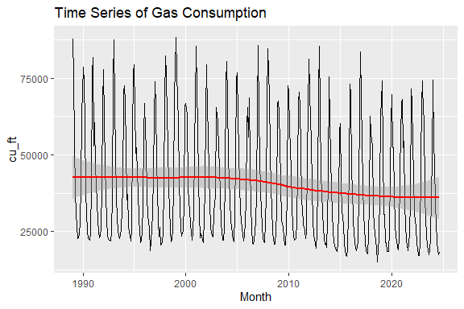<!-- -->

We build histogram and qq-plot to see the features the numbers alone may
miss: in the histogram we see that our data have 2 peaks - qq-plot shows
that the data deviates from normality at the lower left and upper right
corners. deviation in the lower left corner is more pronounced meaning
unusually low gas consumption values are more frequent than expected
under normality.

<!-- -->

**Distribution and Stationarity Tests**

- moderate positive skew 0.73 suggests that while most months have
  average gas use, there are also occasional high-usage months
- the data distribution is platykurtic (flatter than normal), we have
  fewer extreme values than a normal distribution The distribution here
  is roughly symmetric without heavy tails. It means data
  transformations are optional. They still may help stabilize variance.
- according to the ttest result, the mean is different from 0. The
  confidence interval does not include 0 meaning the mean usage is
  significantly greater than 0.
- ADF test checks if the data stationary/non-stationary. The null
  hypothesis (H0) is that the series is non-stationary. In this case
  p-value\<0.05, hence we reject the H0 hypothesis. This series is
  stationary.
- KPSS test also checks if the data stationary or not. The null
  hypothesis (H0) is that the series is stationary. In this case
  p-value\>0.05, hence we fail to reject the H0 hypothesis. This series
  is stationary.

``` r
Skew(gas$cu_ft)
```

    ## [1] 0.7311865

``` r
Kurt(gas$cu_ft)
```

    ## [1] -0.7708642

``` r
t.test(gas$cu_ft)
```

    ## 
    ##  One Sample t-test
    ## 
    ## data:  gas$cu_ft
    ## t = 42.871, df = 428, p-value < 2.2e-16
    ## alternative hypothesis: true mean is not equal to 0
    ## 95 percent confidence interval:
    ##  38216.36 41888.93
    ## sample estimates:
    ## mean of x 
    ##  40052.64

``` r
adf.test(gas$cu_ft)
```

    ## 
    ##  Augmented Dickey-Fuller Test
    ## 
    ## data:  gas$cu_ft
    ## Dickey-Fuller = -17.508, Lag order = 7, p-value = 0.01
    ## alternative hypothesis: stationary

``` r
kpss.test(gas$cu_ft)
```

    ## 
    ##  KPSS Test for Level Stationarity
    ## 
    ## data:  gas$cu_ft
    ## KPSS Level = 0.33572, Truncation lag parameter = 5, p-value = 0.1

**Log-Transformation and Decomposition**

Now we apply log-transformation to make the variance more constant.
After that we perform seasonal decomposition. The decomposition plot
consists of 4 parts:

- original data - even here we can see the seasonality

- seasonal part where we see peaks and troughs and constant shape
  meaning the seasonal behavior is consistent over time. It is an ideal
  pattern for SARIMA model.

- trend part where we see a gradual decrease

- remainder part, in other words, what’s left after removing trend and
  seasonality. It looks like white noise, no clear pattern.

``` r
gas_log <- gas %>% mutate(cu_ft = log(cu_ft))
gas_ts <- ts(gas_log$cu_ft, frequency = 12, start = c(1989, 1))

decomp <- stl(gas_ts, s.window = "periodic")
plot(decomp)
```

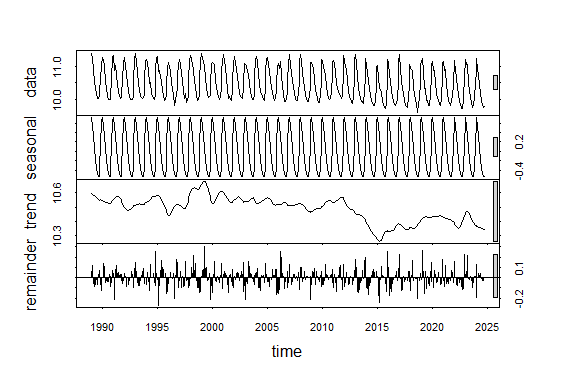<!-- -->

**ACF/PACF plots**

-ACF plot shows a wave-like pattern. It’s a classic autocorrelation
pattern suggesting a seasonal structure.

-PACF: We see gradually shrinking spikes. It means that though AR terms
are at play, their effect diminishes over time.

``` r
# Log-transformed time series
p_acf <- ggAcf(gas_ts, lag.max = 24) +
  ggtitle("ACF of Log-Transf Gas Cons-n") +
  theme_minimal(base_size = 12) +
  theme(plot.title = element_text(hjust = 0.5, face = "bold"))

p_pacf <- ggPacf(gas_ts, lag.max = 24) +
  ggtitle("PACF of Log-Transf Gas Cons-n") +
  theme_minimal(base_size = 12) +
  theme(plot.title = element_text(hjust = 0.5, face = "bold"))

# Combine with patchwork
p_acf + p_pacf
```

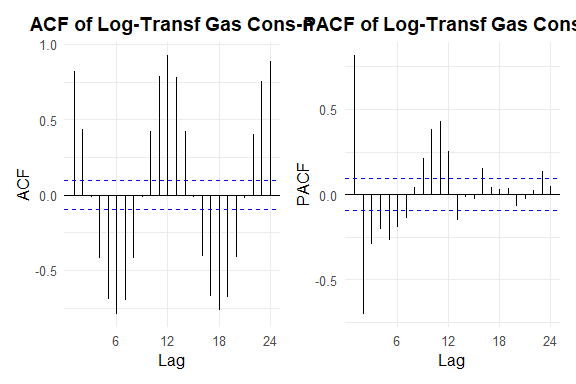<!-- -->

**Splitting into Train and Test**

Here we split the dataset into the train and test subsets using the
chronological hold-out method. We will automatically hold out the last
12 months.

``` r
# Total number of observations
n <- length(gas_ts)

# Compute end of training period (12 months before the last observation)
train_end_index <- n - 12
train_end_year <- start(gas_ts)[1] + (train_end_index - 1) %/% 12
train_end_month <- (train_end_index - 1) %% 12 + 1

# Compute start of testing period (1 month after training ends)
test_start_index <- train_end_index + 1
test_start_year <- start(gas_ts)[1] + (test_start_index - 1) %/% 12
test_start_month <- (test_start_index - 1) %% 12 + 1

# Create the train and test sets
train <- window(gas_ts, end = c(train_end_year, train_end_month))
test <- window(gas_ts, start = c(test_start_year, test_start_month))
```

``` r
gas_ts_orig <- ts(gas$cu_ft, frequency = 12, start = c(1989, 1))
train_orig <- window(gas_ts_orig, end = c(train_end_year, train_end_month))
test_orig <- window(gas_ts_orig, start = c(test_start_year, test_start_month))
```

## Modeling

To prepare an accurate forecast, we need to try different models and
compare different approaches. Taking into consideration the data we
have, we are going to build 3 models. Each model has its strengths.

- **ARIMA** captures autocorrelation (AR), trends (I), and short-term
  shocks (MA). It works well on stationary data, it does not account for
  seasonality.

- **SARIMA** is an ARIMA extension. It explicitly models seasonal
  patterns. We guess this model is the best one for our data.

- **ETS** models the components of time series (trend, seasonality, and
  error) using exponential smoothing. This model works well when the
  seasonality is stable, its strength is that unlike ARIMA/SARIMA, it
  does not require stationarity.

### ARIMA

Our first model is Auto-ARIMA(2,0,1), the parameters were selected
automatically:

- AR (2): The model uses the last 2 observations to explain the current
  value via autoregressive terms.

- I (0): No differencing was applied. The model assumes the original
  series is stationary in level (no trend).

- MA (1): It uses 1 past error term (moving average term) to correct
  current predictions.

- With non-zero mean: The model includes a constant (intercept)

``` r
# Fit ARIMA model to training data
fc_arima_model <- auto.arima(train, seasonal = FALSE)

# Forecast future values (same length as test set)
fc_arima <- forecast(fc_arima_model, h = length(test))

# Plot forecast vs test
autoplot(fc_arima) +
  autolayer(test, series = "Test Data", PI = FALSE) +
  ggtitle("ARIMA: Forecast vs Test Data") +
  ylab("Gas Consumption") +
  xlab("Time")
```

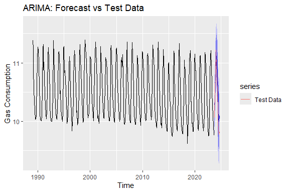<!-- -->

``` r
# Back-transform forecast and prediction intervals
mean_arima <- exp(fc_arima$mean)
lower_arima <- exp(fc_arima$lower)
upper_arima <- exp(fc_arima$upper)

# Convert to ts object with same time index as test_orig
mean_arima  <- ts(mean_arima,  start = start(test_orig), frequency = 12)
lower_arima <- ts(lower_arima[,2], start = start(test_orig), frequency = 12)  # 95% lower bound
upper_arima <- ts(upper_arima[,2], start = start(test_orig), frequency = 12)  # 95% upper bound
```

It is time to perform out-of-sample evaluation. We back-transformed our
data and now compare the results with the data on the original scale. If
we look back at the descriptive statistics, we will see that monthly
consumption spans from 15k to 88k cubic feet and the typical value is
around 33k-40k. What we see here:

- ME shows some overestimation on the training subset and
  underestimation on the test subset

- RMSE and MAE are reasonable (around 13-20% of the mean)

- MAPE is good for train subset. However, out-of-sample MAPE is almost
  21% meaning the model is less reliable in foreacsting recent values

- Theil’s U is better than naive in both cases (U\<1)

There are also signs of mild overfitting because the model fits better
train data than the test data.

``` r
# In-sample fitted values (from model trained on log scale)
fitted_orig <- exp(fitted(fc_arima))

# Out-of-sample forecast mean
fc_mean_arima <- exp(fc_arima$mean)
acc_train_arima <- accuracy(fitted_orig, train_orig)
acc_test_arima  <- accuracy(fc_mean_arima, test_orig)

rownames(acc_train_arima) <- "Train set"
rownames(acc_test_arima)  <- "Test set"

rbind(acc_train_arima, acc_test_arima)
```

    ##                   ME     RMSE      MAE        MPE     MAPE        ACF1
    ## Train set   386.2141 8097.706 5391.260  -1.297284 12.57896 -0.05418465
    ## Test set  -4935.7313 8337.858 6851.335 -18.173380 20.86249  0.24854315
    ##           Theil's U
    ## Train set 0.6190460
    ## Test set  0.7334292

- Ljung-Box test checks if there is autocorrelation at multiple lags
  simultaneously. Ljung-Box p-value\<0.05. Hence, we reject H0
  hypothesis that residuals are randomly distributed. The
  autocorrelation hasn’t been fully captured by the model.

- Mcleod-Li test checks for autocorrelation in squared residuals. 1 out
  of 12 lags had p-values below the 0.05 threshold. There is some
  heteroscedasticity in the residuals.

Conclusion: A more complex model which includes seasonal components is
needed.

``` r
checkresiduals(fc_arima)
```

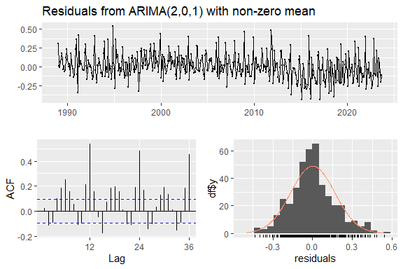<!-- -->

    ## 
    ##  Ljung-Box test
    ## 
    ## data:  Residuals from ARIMA(2,0,1) with non-zero mean
    ## Q* = 420.69, df = 21, p-value < 2.2e-16
    ## 
    ## Model df: 3.   Total lags used: 24

``` r
McLeod.Li.test(y = residuals(fc_arima), gof.lag = 12)
```

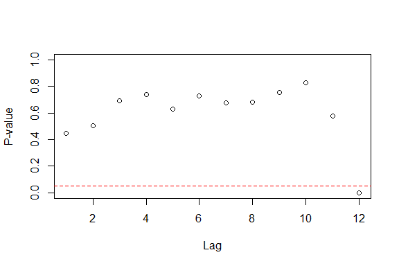<!-- -->

**Conclusion about ARIMA** The ARIMA model demonstrates moderate
in-sample accuracy (MAPE = 12.6%). We can also say that it reasonably
outperforms a naive forecast (Theil’s U = 0.62). However, its
out-of-sample performance declines (MAPE=20.9% and a Theil’s U = 0.73).
The model tends to underpredict recent values (ME = –4,936), and
residual autocorrelation in the test set suggests unmodeled structure
remains. It could be improved, particularly for forecasting more recent
periods.

``` r
# Plot forecast vs test on original scale
autoplot(fc_mean_arima, series = "Forecast") +
  autolayer(test_orig, series = "Test Data", PI = FALSE) +
  ggtitle("Forecast vs Test Data (original scale)") +
  ylab("Gas Consumption (cu ft)") +
  xlab("Time")
```

<!-- -->

### SARIMA

This time we build a SARIMA(2,0,1)(0,1,1)\[12\] model. It captures both
the short-term structure and seasonal pattern.

- smaller errors mean SARIMA outperforms ARIMA

- AIC and BIC are lower than AIC and BIC of ARIMA model meaning better
  fit

``` r
sarima_model <- auto.arima(train)
summary(sarima_model)
```

    ## Series: train 
    ## ARIMA(2,0,1)(0,1,1)[12] with drift 
    ## 
    ## Coefficients:
    ##          ar1      ar2      ma1     sma1   drift
    ##       1.3814  -0.3994  -0.9198  -0.8827  -4e-04
    ## s.e.  0.0622   0.0549   0.0365   0.0351   3e-04
    ## 
    ## sigma^2 = 0.009688:  log likelihood = 358.12
    ## AIC=-704.24   AICc=-704.03   BIC=-680.21
    ## 
    ## Training set error measures:
    ##                        ME       RMSE        MAE         MPE      MAPE     MASE
    ## Training set 0.0009667703 0.09640178 0.07064043 0.001277412 0.6670732 0.679893
    ##                    ACF1
    ## Training set 0.01441977

``` r
fc_sarima <- forecast(sarima_model, h = length(test))
autoplot(fc_sarima) +
  autolayer(test, series = "Test Data", PI = FALSE) +
  ggtitle("SARIMA: Forecast vs Test Data") +
  ylab("Gas Consumption") +
  xlab("Time")
```

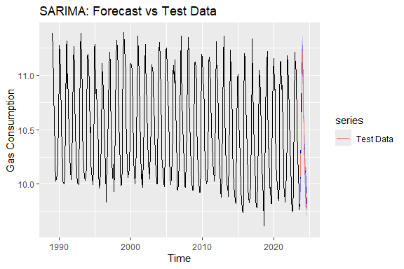<!-- -->

The SARIMA(2,0,1)(0,1,1)\[12\] model with drift demonstrates strong
forecasting performance.

- ME: the model slightly overfits training data but underfits test data

- while RMSE slightly increased on test data, MAE decreased

- MAPE is good both on train and test subsets

- Theil’s U proves the model outperforms naive forecast both on train
  and test data

``` r
# In-sample fitted values (from model trained on log scale)
fitted_sarima <- exp(fitted(sarima_model))

# Out-of-sample forecast mean
fc_mean_sarima <- exp(fc_sarima$mean)
acc_train_sarima <- accuracy(fitted_sarima, train_orig)
acc_test_sarima  <- accuracy(fc_mean_sarima, test_orig)

rownames(acc_train_sarima) <- "Train set"
rownames(acc_test_sarima)  <- "Test set"

rbind(acc_train_sarima, acc_test_sarima)
```

    ##                   ME     RMSE      MAE        MPE     MAPE        ACF1
    ## Train set   197.0909 4739.064 3106.812 -0.3621243 7.029183  0.02697471
    ## Test set  -1615.0774 5071.400 2724.504 -4.7437760 6.476006 -0.31351088
    ##           Theil's U
    ## Train set 0.3467920
    ## Test set  0.4902831

- Ljung-Box test checks if there is autocorrelation at multiple lags
  simultaneously. Ljung-Box p-value\>0.05. Hence, we fail to reject H0
  hypothesis that residuals are randomly distributed. The
  autocorrelation has been fully captured by the model.

- Jarque-Bera test result: p-value\<0.05, hence we reject H0 hypothesis
  that residuals are normally distributed. However, normality of
  residuals is not a strict requirement in time series modeling.

- Histogram is centered around zero.

- The ACF plot of residuals: Lag 13 and 14 are just above the
  significance threshold meaning there’s slight autocorrelation at 13-
  and 14-month lags. There might be slight leftover seasonality, but
  since the Ljung-Box p-value = 0.2504, this is not statistically
  significant.

- This time McLeod-Li test demonstrated a better result: no lags had
  p-values below the 0.05 threshold. There is no heteroscedasticity in
  the residuals.

``` r
checkresiduals(sarima_model)
```

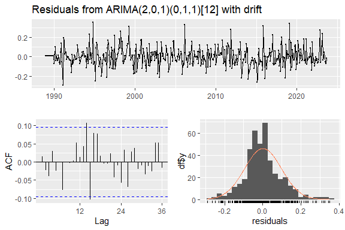<!-- -->

    ## 
    ##  Ljung-Box test
    ## 
    ## data:  Residuals from ARIMA(2,0,1)(0,1,1)[12] with drift
    ## Q* = 23.818, df = 20, p-value = 0.2504
    ## 
    ## Model df: 4.   Total lags used: 24

``` r
tseries::jarque.bera.test(residuals(sarima_model))
```

    ## 
    ##  Jarque Bera Test
    ## 
    ## data:  residuals(sarima_model)
    ## X-squared = 50.304, df = 2, p-value = 1.193e-11

``` r
McLeod.Li.test(y = residuals(sarima_model), gof.lag = 12)
```

<!-- -->

The SARIMA model demonstrates strong in-sample and out-of-sample
performance. The model generalizes well to unseen data. Theil’s U values
below 0.5 in both sets confirm that it outperforms a naive forecast.
Although there is slight underestimation in the test set (ME = –1,615),
and moderate autocorrelation in test residuals (ACF1 = –0.31), the
overall forecast accuracy is reliable.

``` r
# Plot forecast vs test on original scale
autoplot(fc_mean_sarima, series = "Forecast") +
  autolayer(test_orig, series = "Test Data", PI = FALSE) +
  ggtitle("Forecast vs Test Data (original scale)") +
  ylab("Gas Consumption (cu ft)") +
  xlab("Time")
```

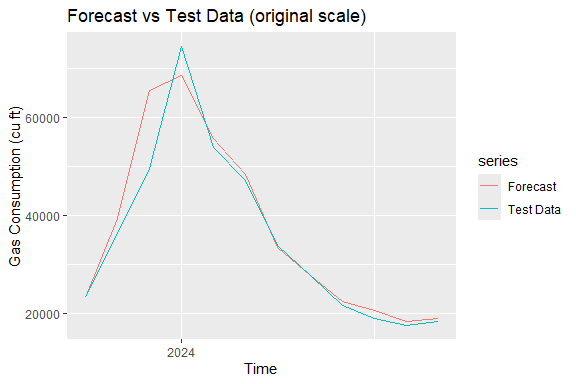<!-- -->

### ETS Model

ETS models are probably also well-suited for monthly gas consumption
data due to their ability to capture trend and seasonality components.
They are especially effective for data with strong recurring seasonal
patterns (such as winter heating demand). Utility data may shift with
climate, behavior, or policy and the ETS model will update its
level/trend/seasonal estimates as new data comes in.

The ETS model fits the data well. The multiplicative error structure
accounts for variability that scales with consumption level, so we can
see it is appropriate for utility data like gas. Forecast errors are low
(MAPE \< 1%) what indicates strong predictive performance. While there’s
mild autocorrelation in residuals (ACF1 = 0.23), overall the model
appears adequate and accurate for short-term seasonal forecasting.

``` r
ets_model <- ets(train)
summary(ets_model)
```

    ## ETS(M,N,A) 
    ## 
    ## Call:
    ## ets(y = train)
    ## 
    ##   Smoothing parameters:
    ##     alpha = 0.3119 
    ##     gamma = 1e-04 
    ## 
    ##   Initial states:
    ##     l = 10.6592 
    ##     s = 0.6388 0.1162 -0.3379 -0.5407 -0.5491 -0.457
    ##            -0.3653 -0.151 0.0458 0.3537 0.5319 0.7145
    ## 
    ##   sigma:  0.0098
    ## 
    ##      AIC     AICc      BIC 
    ## 633.5802 634.7772 694.0765 
    ## 
    ## Training set error measures:
    ##                        ME     RMSE        MAE         MPE   MAPE      MASE
    ## Training set -0.002054386 0.102336 0.07775904 -0.02671758 0.7353 0.7484074
    ##                   ACF1
    ## Training set 0.2334731

``` r
fc_ets <- forecast(ets_model, h = length(test))
autoplot(fc_ets) +
  autolayer(test, series = "Test Data", PI = FALSE) +
  ggtitle("ETS: Forecast vs Test Data") +
  ylab("Gas Consumption") +
  xlab("Time")
```

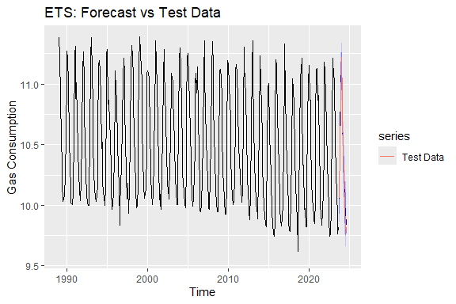<!-- -->

- RMSE, MAE, and MAPE errors are lower on the test set than on training
  indicating that the model generalizes extremely well. No signs of
  overfitting.

- Strong performance out-of-sample. MAPE on test set: 5.56%. This
  forecast is, on average, within 5.56% of the actual values. In time
  series, MAPE \< 10% is good.

- Theil’s U = 0.367 on train and 0.4 on test. Values \< 1 indicate
  better performance than a naive benchmark.

``` r
# In-sample fitted values (from model trained on log scale)
fitted_ets <- exp(fitted(ets_model))

# Out-of-sample forecast mean
fc_mean_ets <- exp(fc_ets$mean)
acc_train_ets <- accuracy(fitted_ets, train_orig)
acc_test_ets  <- accuracy(fc_mean_ets, test_orig)

rownames(acc_train_ets) <- "Train set"
rownames(acc_test_ets)  <- "Test set"

rbind(acc_train_ets, acc_test_ets)
```

    ##                   ME     RMSE      MAE        MPE     MAPE       ACF1 Theil's U
    ## Train set   69.30626 4971.095 3388.149 -0.7272107 7.792878  0.2244391 0.3666395
    ## Test set  -844.36703 4292.596 2320.895 -3.4241886 5.558468 -0.5270967 0.3953965

- Ljung-Box p-value\<0.05. Hence, we reject H0 hypothesis that residuals
  are randomly distributed. The model has missed some time-dependent
  structure and it is a red flag.

- The ACF plot of residuals confirms autocorrelation. Spikes at lags 2,
  4, 6 are above the significance threshold.

- Jarque-Bera test result: p-value\<0.05, hence we reject H0 hypothesis
  that residuals are normally distributed.

- Histogram is centered around zero.

``` r
checkresiduals(ets_model)
```

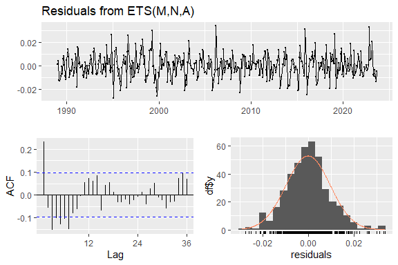<!-- -->

    ## 
    ##  Ljung-Box test
    ## 
    ## data:  Residuals from ETS(M,N,A)
    ## Q* = 78.6, df = 24, p-value = 1.015e-07
    ## 
    ## Model df: 0.   Total lags used: 24

``` r
tseries::jarque.bera.test(residuals(ets_model))
```

    ## 
    ##  Jarque Bera Test
    ## 
    ## data:  residuals(ets_model)
    ## X-squared = 17.712, df = 2, p-value = 0.0001425

``` r
# Plot forecast vs test on original scale
autoplot(fc_mean_ets, series = "Forecast") +
  autolayer(test_orig, series = "Test Data", PI = FALSE) +
  ggtitle("Forecast vs Test Data (original scale)") +
  ylab("Gas Consumption (cu ft)") +
  xlab("Time")
```

<!-- -->

\#Model Comparison

``` r
comparison <- data.frame(
  Model = c("Auto ARIMA", "Auto SARIMA", "ETS"),
  RMSE  = c(acc_train_arima[1, "RMSE"], acc_train_sarima[1, "RMSE"], acc_train_ets[1, "RMSE"]),
  MAE   = c(acc_train_arima[1, "MAE"],  acc_train_sarima[1, "MAE"],  acc_train_ets[1, "MAE"]),
  MAPE  = c(acc_train_arima[1, "MAPE"], acc_train_sarima[1, "MAPE"], acc_train_ets[1, "MAPE"])
)

knitr::kable(comparison, caption = "Model Comparison (Train Set)")
```

| Model       |     RMSE |      MAE |      MAPE |
|:------------|---------:|---------:|----------:|
| Auto ARIMA  | 8097.706 | 5391.260 | 12.578964 |
| Auto SARIMA | 4739.064 | 3106.812 |  7.029183 |
| ETS         | 4971.095 | 3388.149 |  7.792878 |

Model Comparison (Train Set)

``` r
comparison <- data.frame(
  Model = c("Auto ARIMA", "Auto SARIMA", "ETS"),
  RMSE  = c(acc_test_arima[1, "RMSE"], acc_test_sarima[1, "RMSE"], acc_test_ets[1, "RMSE"]),
  MAE   = c(acc_test_arima[1, "MAE"],  acc_test_sarima[1, "MAE"],  acc_test_ets[1, "MAE"]),
  MAPE  = c(acc_test_arima[1, "MAPE"], acc_test_sarima[1, "MAPE"], acc_test_ets[1, "MAPE"])
)

knitr::kable(comparison, caption = "Model Comparison (Test Set)")
```

| Model       |     RMSE |      MAE |      MAPE |
|:------------|---------:|---------:|----------:|
| Auto ARIMA  | 8337.858 | 6851.335 | 20.862486 |
| Auto SARIMA | 5071.400 | 2724.504 |  6.476006 |
| ETS         | 4292.596 | 2320.895 |  5.558468 |

Model Comparison (Test Set)

``` r
autoplot(test_orig, series = "Test Data") +
  autolayer(fc_mean_arima, series = "Auto ARIMA") +
  autolayer(fc_mean_sarima, series = "Auto SARIMA") +
  autolayer(fc_mean_ets, series = "ETS") +
  ggtitle("Forecast Comparison") +
  ylab("Gas Consumption") +
  theme_minimal()
```

<!-- -->

# Conclusion:

We predicted monthly residential gas consumption in California with
three forecasting models: Auto ARIMA, Auto SARIMA, and ETS. We performed
exploratory data analysis, log-transformed the data to stabilize
variance and split the series into training and test sets. Each model
was trained and evaluated using both in-sample (training) and
out-of-sample (test) performance metrics.

All three models performed better than a naive benchmark (Theil’s U \<
1), indicating meaningful predictive power.

While the ETS(M,N,A) model delivered the lowest forecast error on the
test set, residual diagnostics revealed significant autocorrelation and
non-normality. The Ljung-Box test and ACF plots indicated unmodeled
time-dependent structure. The Jarque-Bera test rejected normality of
residuals. These issues suggest the model may have missed important
seasonal dynamics.

The preferred model for gas consumption prediction is SARIMA which
achieved slightly higher forecast error but passed key residual
diagnostics, with near-zero autocorrelation and normally distributed
residuals. This indicates a better-specified model overall.

Conclusion: If pure predictive accuracy is the goal, ETS may be
suitable. However, for applications requiring more reliable uncertainty
quantification, SARIMA is the more statistically sound choice.
