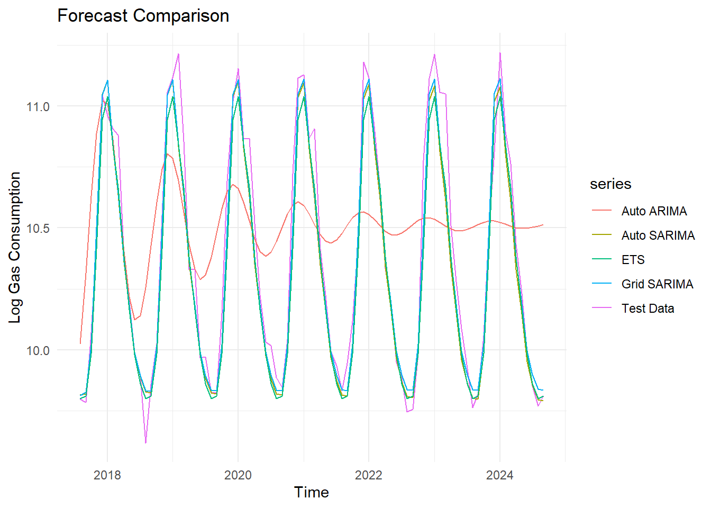

# 🔮 Gas Consumption Forecasting with Time Series Models

Forecasting monthly residential gas consumption in California using ARIMA, SARIMA, and ETS models in R.


---

## 📘 Table of Contents
- [Overview](#overview)
- [Technologies](#technologies)
- [Research Question](#research-question)
- [Dataset](#dataset)
- [Exploratory Data Analysis](#exploratory-data-analysis)
- [Modeling](#modeling)
- [Model Evaluation](#model-evaluation)
- [Forecast Accuracy](#forecast-accuracy)
- [Getting Started](#getting-started)
- [Contact](#contact)

---

## 🧭 Overview

This project forecasts **monthly residential gas consumption in California** using time series models. It compares ARIMA, SARIMA, and ETS models using both forecast accuracy and residual diagnostics to determine the most reliable forecasting approach.

---

## 🧪 Technologies

- **Language:** R
- **Libraries:** `forecast`, `ggplot2`, `tseries`, `urca`, `TSA`, `FinTS`, `DescTools`, `fUnitRoots`, `patchwork`, `dplyr`
- **Models:** ARIMA, SARIMA, ETS (Exponential Smoothing)

---

## ❓ Research Question

> _Which time series forecasting model provides the most accurate and statistically reliable predictions of monthly residential gas consumption in California: ARIMA, SARIMA, or ETS?_

---

## 📊 Dataset

- **Source:** [U.S. EIA - California Natural Gas Consumption](https://www.eia.gov/dnav/ng/hist/n3010ca2m.htm)
- **Frequency:** Monthly
- **Period:** January 1989 – September 2024
- **Unit:** Million Cubic Feet
- **Preprocessing:** One missing value (January 2024) was imputed using the historical January average

---

## 🔍 Exploratory Data Analysis

- **Trend and Seasonality:** Clear annual seasonality with peaks in winter months and troughs in summer
- **Variance Behavior:** A log transformation was applied to stabilize variance
- **Decomposition:** STL decomposition revealed strong seasonal components
- **Distributional Characteristics:** Histogram showed right-skewed distribution (skewness = 0.73, kurtosis = -0.77)
- **Stationarity:** ADF and KPSS tests indicated non-stationarity, addressed using seasonal differencing
- **Autocorrelation:** ACF and PACF plots showed repeating seasonal spikes

---

## ⚙️ Modeling

The following models were developed:

- **Basic ARIMA(2,0,2)**  
  A non-seasonal ARIMA model applied to log-transformed data.

- **Auto SARIMA(2,0,1)(0,1,1)[12]**  
  A seasonal ARIMA model selected by `auto.arima()` with drift.

- **Grid SARIMA(1,0,3)(0,1,1)[12]**  
  A manually tuned SARIMA model selected based on AIC and residual diagnostics.

- **ETS(M,N,A)**  
  A multiplicative error model with no trend and additive seasonality, used as a benchmark.

---

## 📏 Model Evaluation

Models were assessed based on both **forecast accuracy** and **diagnostic tests**:

- **Accuracy metrics**: RMSE, MAE, MAPE, and Theil’s U
- **Residual diagnostics**:
  - **Ljung-Box** for autocorrelation
  - **McLeod-Li** for ARCH effects
  - **Jarque-Bera** for normality
  - **ACF/PACF** plots
  - **Histogram and Q-Q plots**

SARIMA models generally showed better-behaved residuals. The ETS model, while very accurate on the test set, exhibited autocorrelation in residuals and failed the Ljung-Box and Jarque-Bera tests.

---

## 📊 Forecast Accuracy

Forecast performance was evaluated on a holdout test set:

| Model                         | RMSE     | MAE      | MAPE    | Verdict                         |
|------------------------------|----------|----------|---------|----------------------------------|
| SARIMA(1,0,3)(0,1,1)[12]      | 0.0951   | 0.0694   | 0.655%  | ✅ Best model overall            |
| Auto SARIMA(2,0,1)(0,1,1)[12] | 0.0953   | 0.0696   | 0.656%  | Close second                    |
| Basic ARIMA(2,0,2)            | 0.1594   | 0.1197   | 1.13%   | ❌ Misses seasonality            |
| ETS(M,N,A)                   | 0.1016   | 0.0779   | 0.736%  | ❌ Residual autocorrelation present |

<p align="left">
  
</p>

<p align="center"><em>Figure: Forecast comparison across models on the test set</em></p>

---

## 🚀 Getting Started

To reproduce this analysis:

```r
# Install required packages
source("install_packages.R")

# Run the R Markdown file
rmarkdown::render("Gas_Concumption_in_California.Rmd")
